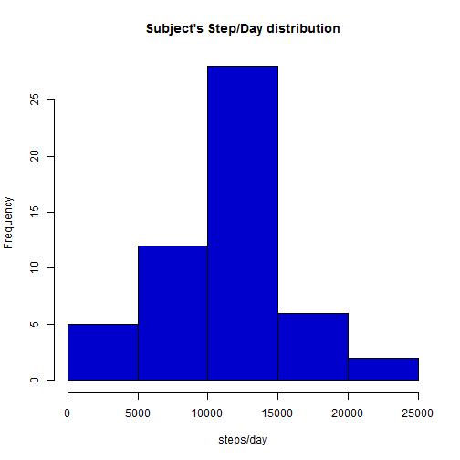
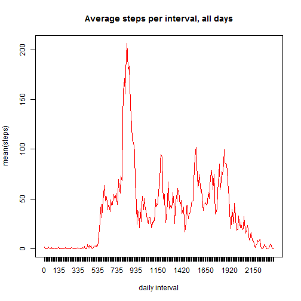
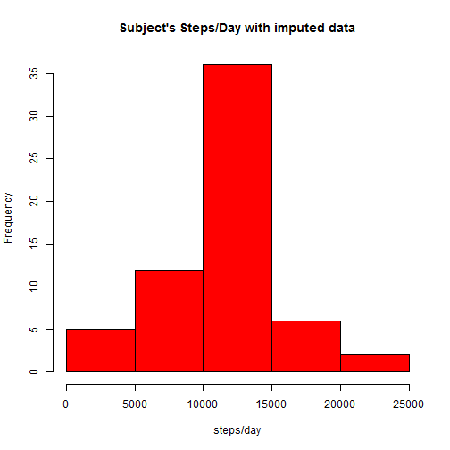
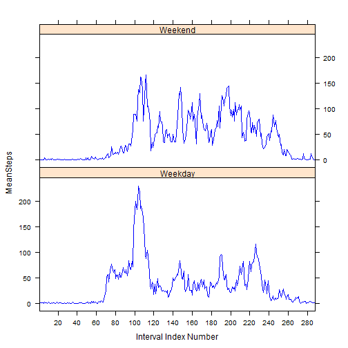

This assignment makes use of data from a single anonymous individual's personal
activity monitoring device, collecting data at 5 minute intervals throughout 
the day, from an anonymous individual during October-November, 2012.  

## Activity Steps Analysis

This analysis looks at:

- The average number of steps per day
- How steps change during the day 
- Whether step activity appears to change from weekday to weekend.

### Loading the Data

The datafile was forked from the course instructor's github repository: 
https://github.com/rdpeng/RepData_PeerAssessment1 

There are many fine ways of unzipping downloaded files, and this is a single
activity compared to the analysis. So I setup the script to be re-run several 
times, and chose to leave off the unzipping code so it is not run every time. 

Reading in and inspecting the .csv file from the working directory:


```r
activity <- read.csv("activity.csv", header = TRUE)
```

```
## Warning in file(file, "rt"): cannot open file 'activity.csv': No such file
## or directory
```

```
## Error in file(file, "rt"): cannot open the connection
```

The variables in this dataset are:

- **steps:** Number of steps taken in a 5-minute interval (missing values = NA)  
- **date:** The date the measurement was taken in YYYY-MM-DD format  
- **interval:** Identifier for the 5-minute interval of the measurement  

The dataset is a comma-separated-value (CSV) file with 17,568 observations.


### Average (Mean) Steps per Day

For this part, we are advised to ignore the missing values in the dataset.

**Calculate the total number of steps/day**

Using 'dplyr' to group and sum steps by date, for a table of total steps/day.
Data are divided into 61 unique days.


```r
library(dplyr)
activity_tbl <- tbl_df(activity)
group_date <- group_by(activity_tbl, date)
step_day <- summarize(group_date, sum(steps))

names(step_day) <- c("date" , "stepsum")   
                            # rename column 2 for manipulation and display
as.numeric(step_day$stepsum)# needed to produce histogram
```

```
##  [1]    NA   126 11352 12116 13294 15420 11015    NA 12811  9900 10304
## [12] 17382 12426 15098 10139 15084 13452 10056 11829 10395  8821 13460
## [23]  8918  8355  2492  6778 10119 11458  5018  9819 15414    NA 10600
## [34] 10571    NA 10439  8334 12883  3219    NA    NA 12608 10765  7336
## [45]    NA    41  5441 14339 15110  8841  4472 12787 20427 21194 14478
## [56] 11834 11162 13646 10183  7047    NA
```

```r
step_day                    # to display step_day table explicitly in document
```

```
## Source: local data frame [61 x 2]
## 
##          date stepsum
## 1  2012-10-01      NA
## 2  2012-10-02     126
## 3  2012-10-03   11352
## 4  2012-10-04   12116
## 5  2012-10-05   13294
## 6  2012-10-06   15420
## 7  2012-10-07   11015
## 8  2012-10-08      NA
## 9  2012-10-09   12811
## 10 2012-10-10    9900
## 11 2012-10-11   10304
## 12 2012-10-12   17382
## 13 2012-10-13   12426
## 14 2012-10-14   15098
## 15 2012-10-15   10139
## 16 2012-10-16   15084
## 17 2012-10-17   13452
## 18 2012-10-18   10056
## 19 2012-10-19   11829
## 20 2012-10-20   10395
## 21 2012-10-21    8821
## 22 2012-10-22   13460
## 23 2012-10-23    8918
## 24 2012-10-24    8355
## 25 2012-10-25    2492
## 26 2012-10-26    6778
## 27 2012-10-27   10119
## 28 2012-10-28   11458
## 29 2012-10-29    5018
## 30 2012-10-30    9819
## 31 2012-10-31   15414
## 32 2012-11-01      NA
## 33 2012-11-02   10600
## 34 2012-11-03   10571
## 35 2012-11-04      NA
## 36 2012-11-05   10439
## 37 2012-11-06    8334
## 38 2012-11-07   12883
## 39 2012-11-08    3219
## 40 2012-11-09      NA
## 41 2012-11-10      NA
## 42 2012-11-11   12608
## 43 2012-11-12   10765
## 44 2012-11-13    7336
## 45 2012-11-14      NA
## 46 2012-11-15      41
## 47 2012-11-16    5441
## 48 2012-11-17   14339
## 49 2012-11-18   15110
## 50 2012-11-19    8841
## 51 2012-11-20    4472
## 52 2012-11-21   12787
## 53 2012-11-22   20427
## 54 2012-11-23   21194
## 55 2012-11-24   14478
## 56 2012-11-25   11834
## 57 2012-11-26   11162
## 58 2012-11-27   13646
## 59 2012-11-28   10183
## 60 2012-11-29    7047
## 61 2012-11-30      NA
```

**Make a histogram of the total number of steps taken each day**

Making the grouping a seperate table to plot summary points into a histogram.


```r
hist(step_day$stepsum, main= "Subject's Step/Day distribution", 
        xlab= "steps/day", col = "blue3")
```

 

**Calculate and report the mean and median of the total number of steps/day:**

-The subject's mean = 10,766.19 steps/day
-The median is similar = 10,765 steps/day

The similarity between these two values implies a somewhat symmetrical shape.


```r
mean(step_day$stepsum, na.rm=TRUE)
```

```
## [1] 10766.19
```

```r
median(step_day$stepsum, na.rm=TRUE)
```

```
## [1] 10765
```

### The average daily activity pattern

How do steps vary by *time interval* across *all days*? 

1. **Time series plot** (i.e. type = "l") of the 5-minute intervals (x-axis) 
and the average number of steps taken across all days (y-axis).

Still using dplyr:


```r
# for this part, going to remove the observations where steps = NA
# this is necessary to be able to calculate means

    badobs <- is.na(activity$steps)
    activityok <- activity[!badobs, ] #subset of activity df, with only not = NA

    library(dplyr)
    interval_tbl <- tbl_df(activityok)      # need a tbl to work with dplyr

# steps/interval are single points along time, not a continuum
# create a time index for x-axis to plot avg steps one data point each    

    interval_tbl$interval <- as.factor(interval_tbl$interval)
    
# group data by interval factor
    group_interval <- group_by(interval_tbl, interval)
    step_interval <- summarize(group_interval, mean(steps))
    
# step_interval is a table of intervals summed over all days

# set the column names for display and to avoid '()'
names(step_interval) <- c("Interval" , "MeanSteps")

#plot will initially suppress x-axis, to insert Interval vector

plot(step_interval$MeanSteps, type="l", col="red", 
     main="Average steps per interval, all days", 
     xlab = "daily interval", ylab = "mean(steps)", 
     xaxt = "n")                    

#insert Interval vector for proper labels

axis(1, 1:288, labels = step_interval$Interval)
```

 

Here is the data table for the time series plot:


```r
# to display sample of table explicitly from which plot is made
step_interval[90:130, ]
```

```
## Source: local data frame [41 x 2]
## 
##    Interval MeanSteps
## 1       725  50.98113
## 2       730  55.67925
## 3       735  44.32075
## 4       740  52.26415
## 5       745  69.54717
## 6       750  57.84906
## 7       755  56.15094
## 8       800  73.37736
## 9       805  68.20755
## 10      810 129.43396
## 11      815 157.52830
## 12      820 171.15094
## 13      825 155.39623
## 14      830 177.30189
## 15      835 206.16981
## 16      840 195.92453
## 17      845 179.56604
## 18      850 183.39623
## 19      855 167.01887
## 20      900 143.45283
## 21      905 124.03774
## 22      910 109.11321
## 23      915 108.11321
## 24      920 103.71698
## 25      925  95.96226
## 26      930  66.20755
## 27      935  45.22642
## 28      940  24.79245
## 29      945  38.75472
## 30      950  34.98113
## 31      955  21.05660
## 32     1000  40.56604
## 33     1005  26.98113
## 34     1010  42.41509
## 35     1015  52.66038
## 36     1020  38.92453
## 37     1025  50.79245
## 38     1030  44.28302
## 39     1035  37.41509
## 40     1040  34.69811
## 41     1045  28.33962
```

2. **Which 5-minute interval, on average across all the days in the dataset,**
**contains the maximum number of steps?**

The maximum = interval 835 with a mean number of steps = 206.2, calculated 
below and and shown in the excerpt of the data table above.


```r
step_interval[which.max(step_interval$MeanSteps),]
```

```
## Source: local data frame [1 x 2]
## 
##   Interval MeanSteps
## 1      835  206.1698
```


### Imputing missing values

There are a number of days/intervals where there are missing values (coded NA). 
Missing days may introduce bias into some calculations or summaries of the data.

1. **Calculate and report the total number of missing values in the dataset** 
(i.e. the total number of rows with NAs)

- 2304 obs of steps recorded are NA
- 15,840 intervals have steps recorded, to include zero as an observed value


```r
summary(activity)
```

```
##      steps                date          interval     
##  Min.   :  0.00   2012-10-01:  288   Min.   :   0.0  
##  1st Qu.:  0.00   2012-10-02:  288   1st Qu.: 588.8  
##  Median :  0.00   2012-10-03:  288   Median :1177.5  
##  Mean   : 37.38   2012-10-04:  288   Mean   :1177.5  
##  3rd Qu.: 12.00   2012-10-05:  288   3rd Qu.:1766.2  
##  Max.   :806.00   2012-10-06:  288   Max.   :2355.0  
##  NA's   :2304     (Other)   :15840
```


2 & 3. **Devise a strategy for filling in all of the missing values in the dataset**
For example, mean/median for that day, mean for that 5-minute interval, etc:

- **Imputing Strategy:** Use StepMean for the interval from 'step_interval' 
data table above. This strategy would be chosen if the interval is assumed
to be most influential, and most representative of missing data.

This strategy could lead to bias if the particular day turns out to be more
important, but is a reasonable strategy for this stage of the exploration, 
especially given the apparent influence shown in the time-series plot:

-**Code** showing how to create a new dataset equal to the original but missing data filled in, using this strategy:


```r
imputed <- activity     # identical to original without disturbing original
names(imputed) <- c("Steps", "Date" , "Interval")
imputed$Interval <- as.factor(imputed$Interval)

interval_join <- left_join(imputed, step_interval, by ="Interval")

lastrow <- nrow(imputed)

#condition, if steps = NA for each row
# then replace with imputation strategy

for (i in 1:lastrow) {
    if(is.na(imputed[i,"Steps"]))   
        
        {imputed[i, "Steps"]  <-  interval_join[i, "MeanSteps"]
        }    
    }

# now the table 'imputed' has NA's replaced by interval means
```


4. ** Histogram of the total number of steps taken each day with imputed data**
and calculate the mean and median for total steps/day

Regrouping new data by date, as before but using the 'imputed' data table:


```r
library(dplyr)

imputed_date <- group_by(imputed, Date)
imputed_stepday <- summarize(imputed_date, sum(Steps))

names(imputed_stepday) <- c("Date","StepSum") # rename for manipulation, display

hist(imputed_stepday$StepSum, main= "Subject's Steps/Day with imputed data", 
        xlab= "steps/day", col = "red")
```

 

```r
mean(imputed_stepday$StepSum, na.rm=TRUE)
```

```
## [1] 10766.19
```

```r
median(imputed_stepday$StepSum, na.rm=TRUE)
```

```
## [1] 10766.19
```

```r
imputed_stepday         # to display step_day table explicitly in document
```

```
## Source: local data frame [61 x 2]
## 
##          Date  StepSum
## 1  2012-10-01 10766.19
## 2  2012-10-02   126.00
## 3  2012-10-03 11352.00
## 4  2012-10-04 12116.00
## 5  2012-10-05 13294.00
## 6  2012-10-06 15420.00
## 7  2012-10-07 11015.00
## 8  2012-10-08 10766.19
## 9  2012-10-09 12811.00
## 10 2012-10-10  9900.00
## 11 2012-10-11 10304.00
## 12 2012-10-12 17382.00
## 13 2012-10-13 12426.00
## 14 2012-10-14 15098.00
## 15 2012-10-15 10139.00
## 16 2012-10-16 15084.00
## 17 2012-10-17 13452.00
## 18 2012-10-18 10056.00
## 19 2012-10-19 11829.00
## 20 2012-10-20 10395.00
## 21 2012-10-21  8821.00
## 22 2012-10-22 13460.00
## 23 2012-10-23  8918.00
## 24 2012-10-24  8355.00
## 25 2012-10-25  2492.00
## 26 2012-10-26  6778.00
## 27 2012-10-27 10119.00
## 28 2012-10-28 11458.00
## 29 2012-10-29  5018.00
## 30 2012-10-30  9819.00
## 31 2012-10-31 15414.00
## 32 2012-11-01 10766.19
## 33 2012-11-02 10600.00
## 34 2012-11-03 10571.00
## 35 2012-11-04 10766.19
## 36 2012-11-05 10439.00
## 37 2012-11-06  8334.00
## 38 2012-11-07 12883.00
## 39 2012-11-08  3219.00
## 40 2012-11-09 10766.19
## 41 2012-11-10 10766.19
## 42 2012-11-11 12608.00
## 43 2012-11-12 10765.00
## 44 2012-11-13  7336.00
## 45 2012-11-14 10766.19
## 46 2012-11-15    41.00
## 47 2012-11-16  5441.00
## 48 2012-11-17 14339.00
## 49 2012-11-18 15110.00
## 50 2012-11-19  8841.00
## 51 2012-11-20  4472.00
## 52 2012-11-21 12787.00
## 53 2012-11-22 20427.00
## 54 2012-11-23 21194.00
## 55 2012-11-24 14478.00
## 56 2012-11-25 11834.00
## 57 2012-11-26 11162.00
## 58 2012-11-27 13646.00
## 59 2012-11-28 10183.00
## 60 2012-11-29  7047.00
## 61 2012-11-30 10766.19
```


For the histogram shown above:

**Calculate and report the mean and median total number of steps taken per day.** 

- Mean = 10766.19
- Median = 10766.19

**Do these values differ from the estimates from the first part of the assignment?**

Using my strategy, the mean is the same, the median has moved into line with the median.

**What is the impact of imputing missing data on the estimates of the total** 
**daily number of steps?**

The impact of imputing missing data with the strategy of using average interval
values adds to the number of total data points, particularly in the MIDDLE of the 
distribution; it accentuates the center of the data because we have added many
average values throughout the day.


###Differences in activity patterns between weekdays and weekends

For this part the weekdays() function may be of some help here. Use the dataset with the filled-in missing values for this part **'imputed'**.

1. **Create a new factor variable in the dataset with two levels - "weekday"** 
**and "weekend" indicating whether a given date is a weekday or weekend day.**


```r
library(dplyr)

# currently 'imputed' has Date as a factor. Must convert to date type
imputed$Date <- as.Date(imputed$Date, "%Y-%m-%d")

# adding two columns, modifying the second to preserve weekday as well as factor
imputed <- mutate(imputed, DayofWeek=weekdays(imputed$Date))
imputed <- mutate(imputed, Weekend=weekdays(imputed$Date))

last <- nrow(imputed)

for (i in 1:last) {
    
    if(imputed[i,"DayofWeek"]== c("Saturday"))
        {imputed[i, "Weekend"] <- c("Weekend")}

    else if(imputed[i, "DayofWeek"]== c("Sunday"))
        {imputed[i, "Weekend"] <- c("Weekend")}
    
    else {imputed[i, "Weekend"] <- c("Weekday")} 
        }    

# To show samples of the resulting data table
imputed[1:10,]
```

```
##        Steps       Date Interval DayofWeek Weekend
## 1  1.7169811 2012-10-01        0    Monday Weekday
## 2  0.3396226 2012-10-01        5    Monday Weekday
## 3  0.1320755 2012-10-01       10    Monday Weekday
## 4  0.1509434 2012-10-01       15    Monday Weekday
## 5  0.0754717 2012-10-01       20    Monday Weekday
## 6  2.0943396 2012-10-01       25    Monday Weekday
## 7  0.5283019 2012-10-01       30    Monday Weekday
## 8  0.8679245 2012-10-01       35    Monday Weekday
## 9  0.0000000 2012-10-01       40    Monday Weekday
## 10 1.4716981 2012-10-01       45    Monday Weekday
```

```r
imputed[1500:1510,]
```

```
##      Steps       Date Interval DayofWeek Weekend
## 1500     0 2012-10-06      455  Saturday Weekend
## 1501     0 2012-10-06      500  Saturday Weekend
## 1502     0 2012-10-06      505  Saturday Weekend
## 1503     0 2012-10-06      510  Saturday Weekend
## 1504     0 2012-10-06      515  Saturday Weekend
## 1505     0 2012-10-06      520  Saturday Weekend
## 1506     0 2012-10-06      525  Saturday Weekend
## 1507     0 2012-10-06      530  Saturday Weekend
## 1508     0 2012-10-06      535  Saturday Weekend
## 1509    27 2012-10-06      540  Saturday Weekend
## 1510     0 2012-10-06      545  Saturday Weekend
```

```r
imputed[1890:1900,]
```

```
##      Steps       Date Interval DayofWeek Weekend
## 1890     0 2012-10-07     1325    Sunday Weekend
## 1891    44 2012-10-07     1330    Sunday Weekend
## 1892     0 2012-10-07     1335    Sunday Weekend
## 1893     0 2012-10-07     1340    Sunday Weekend
## 1894     0 2012-10-07     1345    Sunday Weekend
## 1895     0 2012-10-07     1350    Sunday Weekend
## 1896     0 2012-10-07     1355    Sunday Weekend
## 1897     0 2012-10-07     1400    Sunday Weekend
## 1898     0 2012-10-07     1405    Sunday Weekend
## 1899     0 2012-10-07     1410    Sunday Weekend
## 1900     0 2012-10-07     1415    Sunday Weekend
```

2.**Make a panel plot containing a time series plot (i.e. type = "l") of the**
**5-minute interval (x-axis) and the average number of steps taken, averaged**
**across all weekday days or weekend days (y-axis).** 

See the README file in the GitHub repository to see an example of what this plot
should look like using simulated data. 

*Remember that this plot can be created using ANY plotting system*, 
it does not have to be LATTICE.


```r
library(lattice)
library(dplyr)

imputed$Weekend <- as.factor(imputed$Weekend)

# Must group by both factors, the interval and whether it is a weekend or not
imputed2 <- group_by(imputed, Interval, Weekend)
imputed_wknd <- summarize(imputed2, mean(Steps))

# rename for manipulation, display
names(imputed_wknd) <- c("Interval","Weekend", "MeanSteps") 

#separate dataset to make a single x axis label
xlabels <- filter(imputed_wknd, Weekend == "Weekday")

xyplot(MeanSteps ~ Interval | Weekend, data = imputed_wknd,
       layout= c(1,2), type="l", lty = 1, col="blue", xlab="Interval Index Number",
       scales=list(x = list(at=seq(from=0, to= 280, by = 20))))
```

 

It appears that the subject is able to walk more consistently through the 
daily intervals on weekends than on weekdays, which has a long spike early in
the day followed by extended periods of lower level activity.


